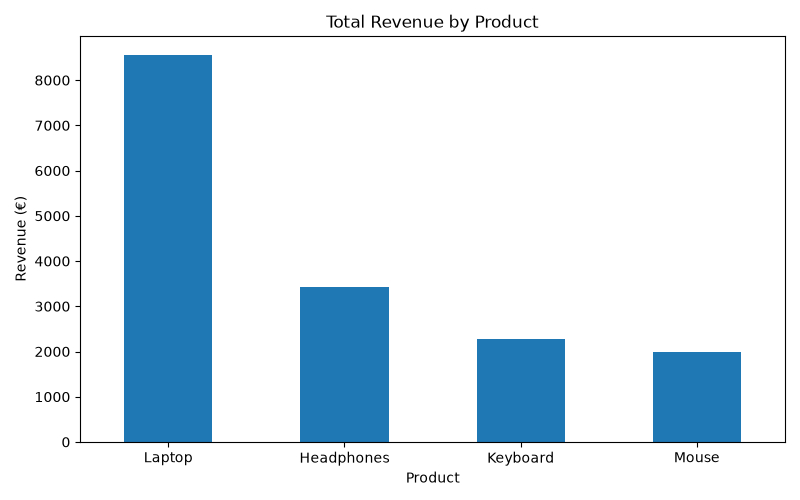
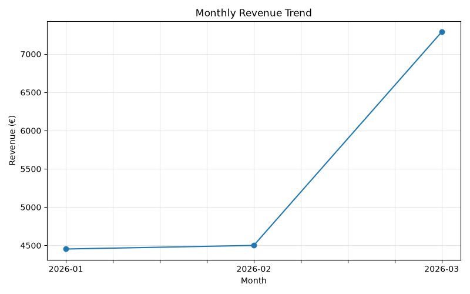
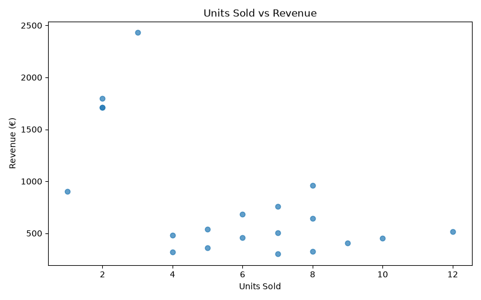

# 📊 Sales Data Analysis

## Project Overview

This is a beginner data analysis project created using Python, Pandas, NumPy and Matplotlib.

The purpose of this project is to analyse sales data and explore patterns in product performance, regional sales and revenue over time.

I created this project as part of my journey into Data Science and to practise working with data using Python.

## 🛠 Technologies Used

- Python
- Pandas
- NumPy
- Matplotlib

## 📁 Dataset

The dataset contains sales information including:

- Date
- Product
- Region
- Units Sold
- Unit Price
- Discount

The project calculates additional information such as gross revenue, discount amount and final revenue.

> Note: The dataset used in this project is a synthetic dataset created for learning and demonstration purposes.

## 🔍 Questions Explored

This project explores questions such as:

- Which product generates the highest revenue?
- Which region performs the best?
- How does revenue change over time?
- What is the average revenue per sale?
- How many sales are above the average revenue?

## 📈 Revenue by Product



## 📈 Monthly Revenue Trend



## 📊 Units Sold vs Revenue



## 🧹 Data Processing

The Python script performs several data processing steps:

1. Loads the CSV dataset using Pandas.
2. Checks the structure and missing values.
3. Converts the date column into datetime format.
4. Calculates gross revenue.
5. Calculates discounts.
6. Calculates final revenue.
7. Groups sales by product and region.
8. Performs basic statistical analysis using NumPy.
9. Creates visualisations using Matplotlib.

## 🚀 How to Run the Project

Clone or download this repository and install the required libraries:

```bash
pip install -r requirements.txt