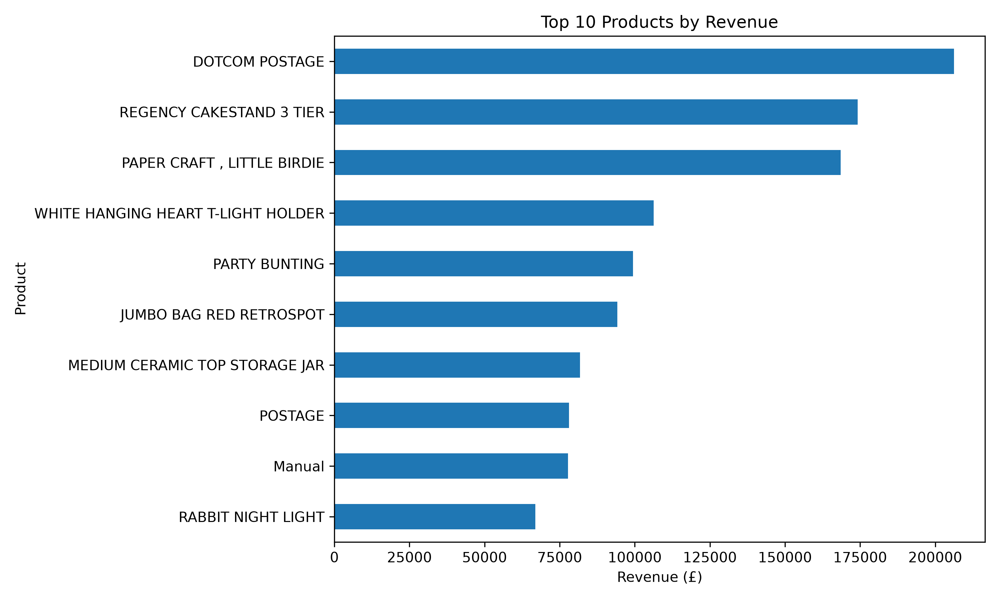
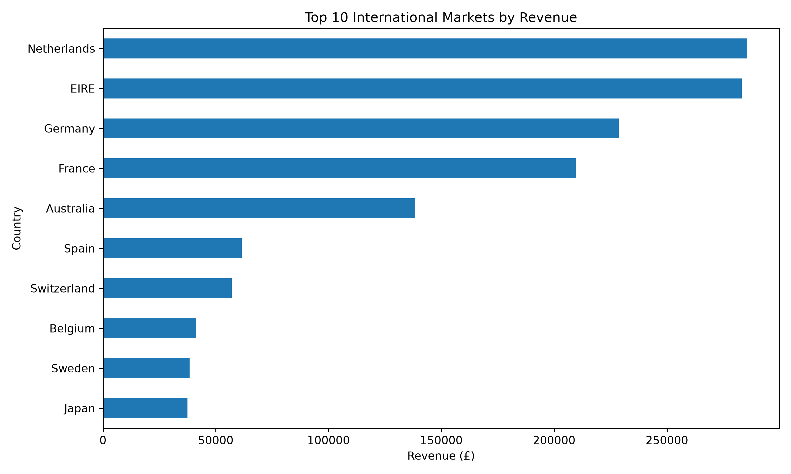
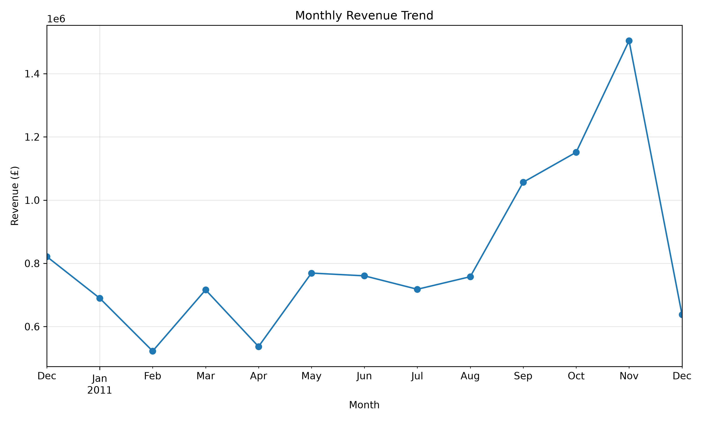
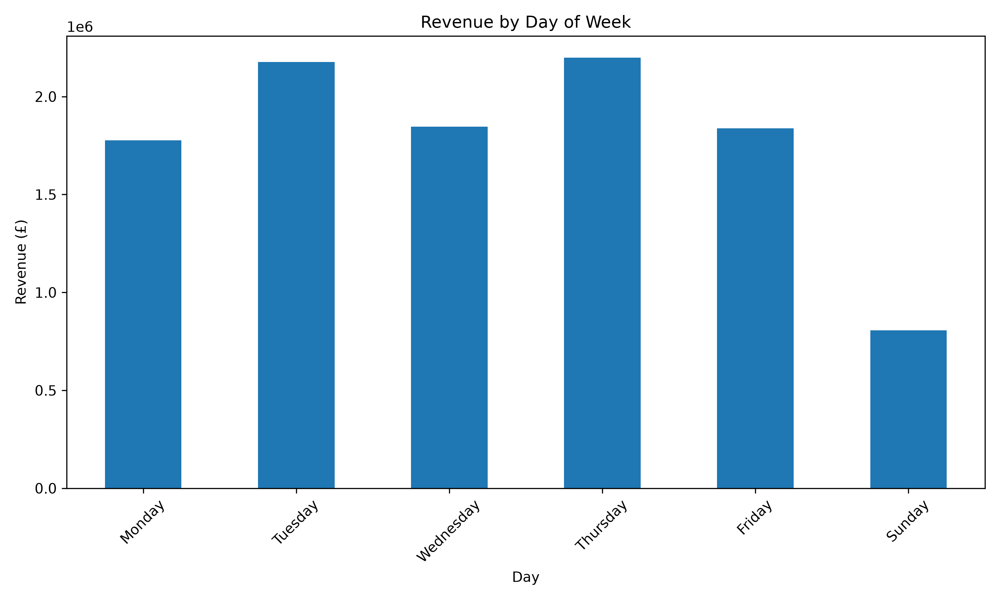

# Online Retail Sales Data Analysis

## Project Overview

This project analyses a real-world online retail dataset using Python, Pandas, NumPy and Matplotlib.

The aim of the project is to clean and explore transactional sales data, identify important business patterns, and create visualisations that make the results easier to understand.

I built this project as part of my learning journey in Data Science and to practise working with a large real-world dataset.

## Dataset

The project uses the **Online Retail Dataset** from the UCI Machine Learning Repository.

The dataset contains more than 500,000 transaction records from a UK-based online retailer.

Main columns include:

* Invoice number
* Product code
* Product description
* Quantity
* Invoice date
* Unit price
* Customer ID
* Country

Dataset source:

https://archive.ics.uci.edu/dataset/352/online+retail

## Tools Used

* Python
* Pandas
* NumPy
* Matplotlib
* OpenPyXL
* VS Code
* Git & GitHub

## Data Cleaning

Before analysing the data, I performed several cleaning steps:

* Removed duplicate rows
* Removed rows with missing product descriptions
* Removed cancelled invoices
* Removed non-positive quantities
* Removed non-positive unit prices
* Created a new Revenue column

Revenue was calculated as:

`Revenue = Quantity × Unit Price`

## Analysis Performed
## Key Findings

After cleaning and analysing the Online Retail dataset, I identified several key insights:

- The original dataset contained 541,909 transaction records. After removing duplicates, cancelled transactions, missing product descriptions and invalid quantity or price values, 524,878 records remained. Approximately 3.14% of the original data was removed during cleaning.

- The cleaned dataset generated approximately £10.64 million in total revenue from 19,960 orders and more than 5.57 million units sold.

- The average order value was approximately £533.17.

- The United Kingdom was by far the largest market, generating approximately £9 million in revenue. Among international markets, the Netherlands, Ireland, Germany and France were some of the strongest contributors.

- Revenue increased significantly toward the later months of 2011, with November 2011 generating approximately £1.15 million, making it the strongest full month in the analysed period.

- Product revenue was concentrated among several high-performing items. DOTCOM POSTAGE generated the highest revenue, followed by products such as REGENCY CAKESTAND 3 TIER and PAPER CRAFT, LITTLE BIRDIE.

These findings demonstrate how transactional data can be transformed into useful information about product performance, market contribution and sales trends.

## Visualisations

### Top 10 Products by Revenue



### Top International Markets



### Monthly Revenue Trend



### Revenue by Day of Week



## Project Structure

```text
sales-data-analysis/
│
├── data/
│   └── dataset files
│
├── images/
│   ├── top_products.png
│   ├── top_countries.png
│   ├── monthly_revenue.png
│   └── revenue_by_day.png
│
├── sales_analysis.py
├── requirements.txt
├── .gitignore
└── README.md
```

## How to Run

Install the required libraries:

```bash
python3 -m pip install -r requirements.txt
```

Download the Online Retail dataset from the UCI Machine Learning Repository and place:

```text
Online Retail.xlsx
```

inside the:

```text
data/
```

folder.

Then run:

```bash
python3 sales_analysis.py
```

## What I Learned

Through this project, I practised working with a large real-world dataset and learned how to follow a basic data analysis workflow:

* Loading data
* Inspecting data quality
* Cleaning invalid records
* Creating new variables
* Grouping and aggregating data
* Analysing time-based trends
* Creating visualisations
* Interpreting business results

I also gained more practical experience with Pandas functions such as `groupby()`, `drop_duplicates()`, filtering, sorting, aggregation and datetime operations.

## Future Improvements

I plan to continue improving this project by adding:

* Customer segmentation
* RFM analysis
* More statistical analysis
* Interactive Power BI dashboards
* A Streamlit dashboard
* Basic machine learning techniques
